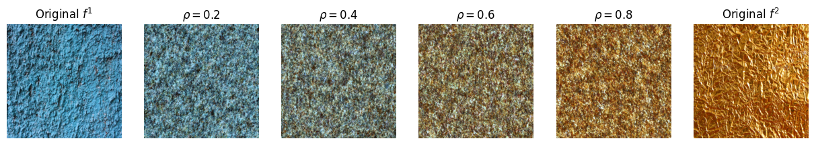
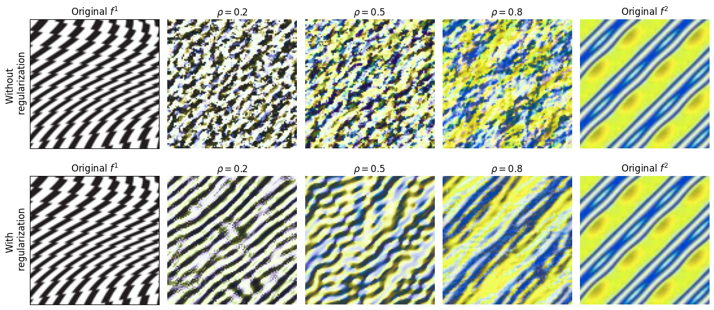

# Wasserstein Barycenter and its Application to Texture Mixing



This project is dedicated to the study of the paper *"Wasserstein Barycenter and its Application to Texture Mixing"*. The objective is to reproduce the results from the paper, analyze its limitations, and propose solutions.

## 🛠️ Project Structure

- **`data/`**: Contains all the necessary data (images) required to run the code.
- **`experiments/`**: Includes notebooks that replicate results, analyze limitations, and propose solutions. These notebooks are structured as follows:
  - **Notebook 1**: Basic functions from wasserstein distances, wasserstein barycenters and sliced approximations.
  - **Notebook 2**: Decomposition of the texture into wavelet coefficients.
  - **Notebook 3**: Reproduces the results of the paper for first order method and highlights the limitations.
  - **Notebook 4**: Implements potential solutions to address the identified limitations.
  - **Notebook 5**: Summarizes and visualizes the final results.
- **`outputs/`**: Stores the figures generated by running the notebooks.
- **`utils/`**: Contains helper functions used throughout the project.
- **`wasserstein/`**: Includes functions for calculating Wasserstein distances and barycenters, decomposing/recomposing the texture into coefficients etc.              

## 🚀 How to Run the Project

1. Clone the repository:
   ```bash
   git clone https://github.com/your-name/Convolutional-Wasserstein-Distances.git
   cd Convolutional-Wasserstein-Distances

2. Install the dependencies:
   ```bash
   pip install -r requirements.txt

3. Run the notebooks in the **`experiments/`** folder sequentially.

## 🔧 Code Architecture

```plaintext
Wasserstein-Barycenter-Project/  
├── data/                        
├── experiments/                 
│   ├── 1_projections_barycenter.ipynb       
│   ├── 2_wavelet_coefficients.ipynb         
│   ├── 3_texture_mixing_first_order.ipynb   
│   ├── 4_texture_mixing_with_reg.ipynb      
│   └── 5_high_dimensional_texture_mix.ipynb         
├── outputs/                     
├── utils/                                   
│   ├── basic_wasserstein.py    
│   ├── image_treatment.py      
│   └── projections.py                       
├── wasserstein/                 
│   ├── texture_mixing_new.py  
│   └── texture_mixing_with_reg.py             
├── requirements.txt             
└── README.md
```  

## 🌟 Output examples

- Texture mixing with 4 inputs
   


- Texture mixing with and without regularization
  


## 📝 License

This project was created by:
- Marion Chabrol
- Suzie Grondin
- Corentin Pernot

## 🔗 Links

- GitHub Repository: [https://github.com/mchabrol/Convolutional-Wasserstein-Distances](https://github.com/mchabrol/Convolutional-Wasserstein-Distances)
